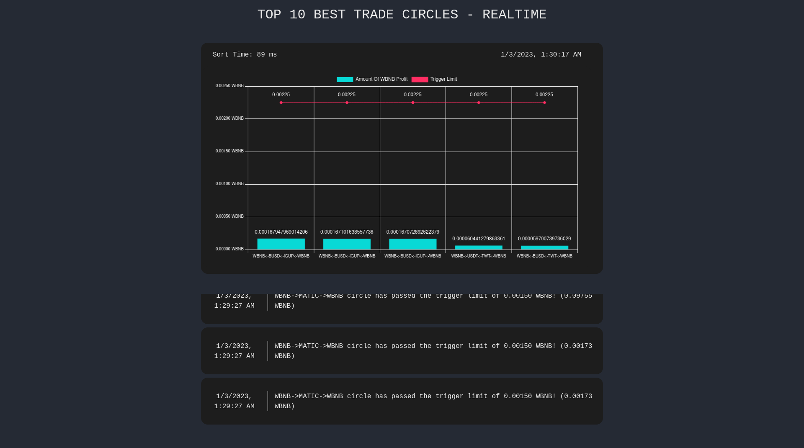

# DexEqualizer - A BSC Arbitrage Bot

This is an arbitrage bot that does triangular arbitrage between Uniswap V2 clones in Binance Smart Chain.
Since the bot is barely profitable anymore, I've decided to publish it with the GitHub.
I've really worked hard for this bot for around ~2 months, and I've learnt a lot of things about EVM.

There is only few chance of arbitrage and if someone frontruns you, you can't get anything from that arbitrage chance
and there are many "researchers" in the field. Even through I've tried many options I couldn't able to gain the amounts I've hoped for.

I've both tried flashloan and regular triangular arbitrages and you can find the contracts for the flashloan arbitrage in other branch of this repository.

I won't be publishing how to use this, but you can manage to work out from the source code.

# Web UI

The Web UI is just a simple HTML page with Websocket that communicates with the bot and visualizes transactions.



# Transaction Examples

Those are few examples of the transactions that bot sent.

- https://bscscan.com/tx/0x3db3f6af4e8b7449aa8a3e683303cb06f1d1b080d409eb69503b5a1bc9513ac8
- https://bscscan.com/tx/0xe4bca19c8ad9e82078e8f542eafc3639e2b3680622b7098f71bc9e05ec0e9f1b
- https://bscscan.com/tx/0x3db3f6af4e8b7449aa8a3e683303cb06f1d1b080d409eb69503b5a1bc9513ac8


# Features

There might be other features that I forgot to mention.

- Written in Go. (Build with `-gcflags=-l`.)
- Modified go-ethereum for listening websocket messages. (Increased buffers etc.)
- Supports Uniswap V2 clones with fixed fee rate.
- Supports Binance Smart Chain.
- Supports multicall.
- Supports CHI Gas token.
- Finds hot tokens for the network.
- Finds all pair combinations for the tokens.
- A Web UI to monitor the graph and the orders.
- Flashloan and regular arbitrage. (Check out branches.)
- Finds all arbitrage paths with multiprocessing DFS.
- Uses timsort to sort opportunities.
- Active frontrunner. (Uses `debug_traceCall`)
- Auto stop on limit balance.
- Auto stop on low CHI balance.
- Supports multihop between tokens.
- Auto calculate the input amount.

# Arbitrage Opportunities

There are many variables that changes the arbitrage opportunity, some of them are;

- The gas you are using in the arbitrage transaction.
- The tokens that you are monitoring for arbitrage.
- The DEX'es that you are monitoring for arbitrage.

Basically, the first one determines your profit from the transaction. If you use less gas for the transaction,
you are going find more arbitrage opportunities because you're sniping limit gets lower.
For the second and the third ones, you can be the first one to find the arbitrage opportunities if you are looking to a pair that no-one is checking.

TL;DR, each swap costs gas and you must lower the gas usage to make your transaction work. You must find a strategy to pass others.


# Config Template

Create a file named `config.yml` inside the `./chains/56/` folder and use the following template.

```yaml
#
# The network information.
#
Network:
  Private Key: ""
  WETH: "0xbb4cdb9cbd36b01bd1cbaebf2de08d9173bc095c"

#
# Environment contracts.
#
Contracts:
  Executor: ""
  Gas Token: "0x0000000000004946c0e9F43F4Dee607b0eF1fA1c"
  Multicaller: "0x41263cba59eb80dc200f3e2544eda4ed6a90e76c"

#
# The arbitrage options.
#
Arbitrage Options:
  #
  # Limit options.
  # (stop limit.)
  Limiters:
    Max Amount In: "0" # Maximum input WETH amount for one transaction.
    Stop Balance: "0" # Minimum ETH balance to stop the program.

    # DFS Parameters
    Max Hops: 2  # Maximum amount of hops in an arbitrage transaction.
    Min Hops: 2  # Minimum amount of hops in an arbitrage transaction.
    Max Circles: 2500  # Maximum amount of circles to monitor.

  # (This field is not active.)
  # Gas options.
  Gas Options:
    Extra Gas Percent: 25
```
# Support ❤️

You can help me and my projects by donating to this wallet;
(BSC, ETH, SOL, stable tokens.)
[0x2d5dA0a6DdDdD7598ebBA223cB82D3088e9c843a](https://bscscan.com/address/0x2d5da0a6ddddd7598ebba223cb82d3088e9c843a).